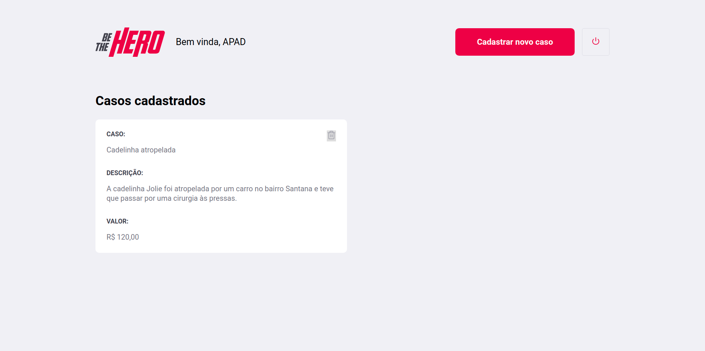

# Projeto

O BeTheHero é um projeto que consiste em uma plataforma web onde ONG's (Organizações não governamentais) podem cadastrar casos em que necessitam de ajuda monetária e um aplicativo mobile pelo qual qualquer pessoa pode contribuir.

O projeto foi desenvolvido com as seguintes tecnologias:

- [Node.js](https://nodejs.org/en/)
- [React](https://reactjs.org)
- [React Native](https://facebook.github.io/react-native/)
- [Expo](https://expo.io/)

# Screenshots

## Login

## Cadastro de ONG's

## Listagem de casos de uma ONG

## Cadastro de casos

## Aplicativo mobile

